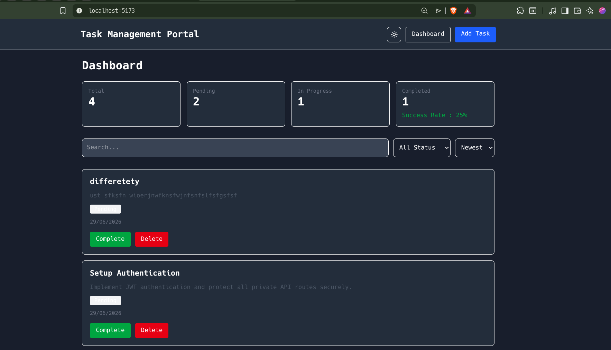
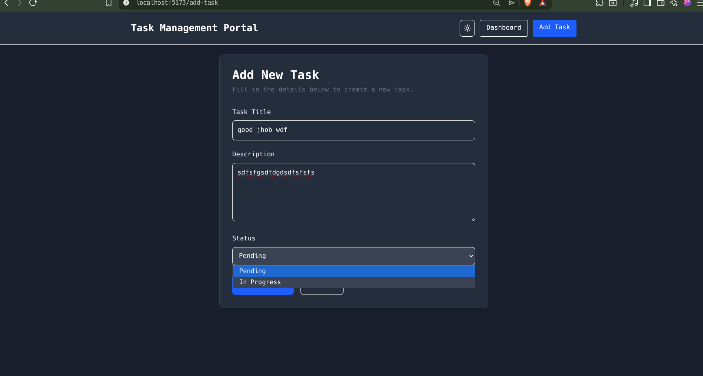
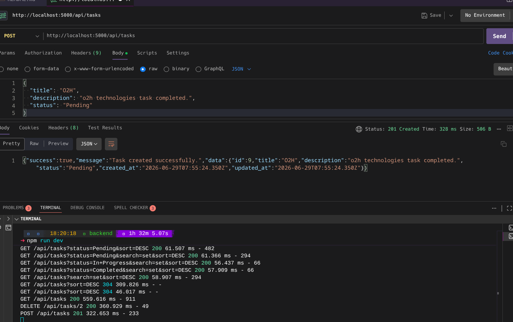
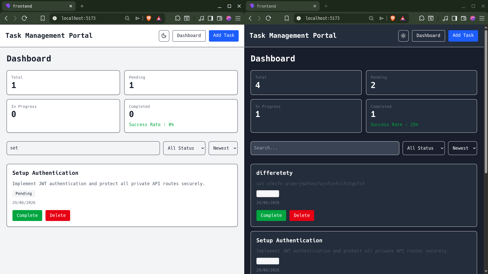
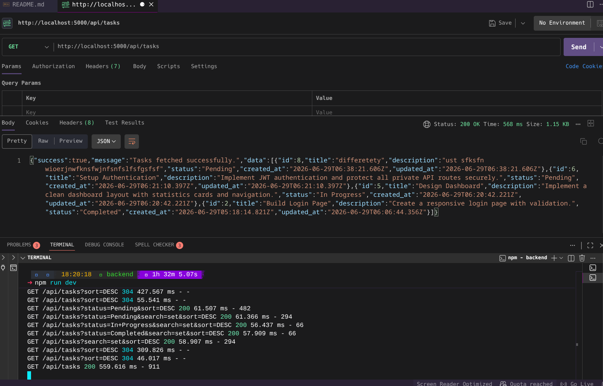
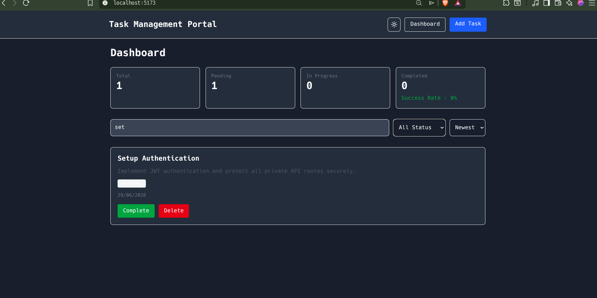
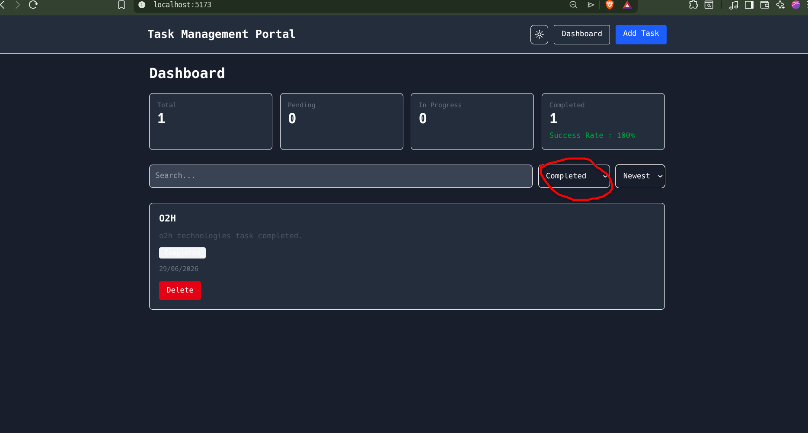
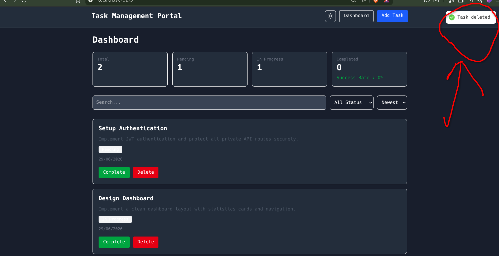
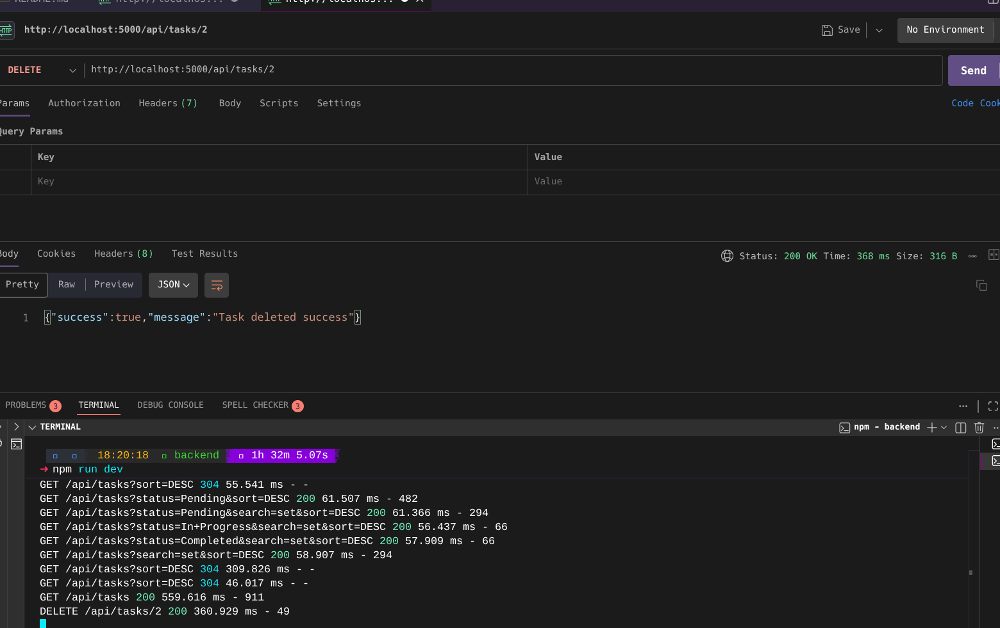
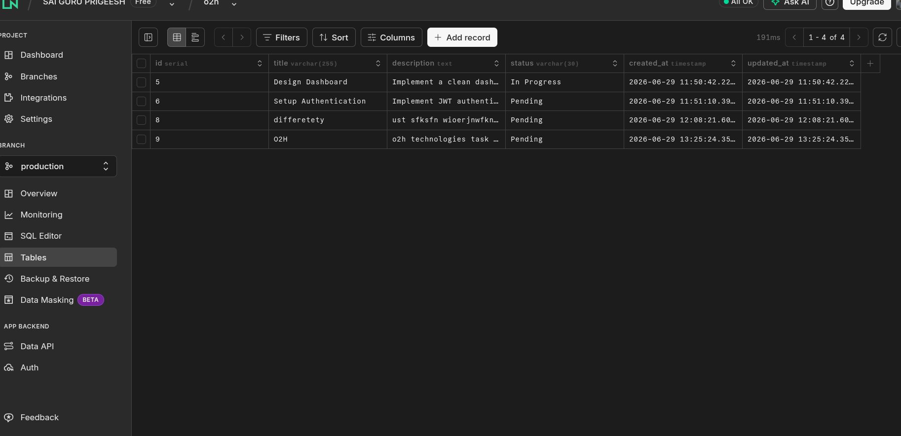

# Mini Project Management Portal

## Project Overview

A Full Stack Task Management Application built using React, TypeScript, Node.js, Express, and PostgreSQL.

The application allows users to:

- Sign in with Google OAuth2
- Keep tasks separated per user
- View all tasks
- Create new tasks
- Update task status
- Delete tasks
- Search tasks
- Filter tasks by status
- Sort tasks by creation date
- View dashboard statistics
- Toggle between Dark and Light themes

This project was developed as part of the Full Stack Application Developer Hiring Assessment.

---

## Tech Stack

### Frontend

- React 19
- TypeScript
- Vite
- React Router DOM
- Axios
- React Hook Form
- React Hot Toast
- Tailwind CSS

### Backend

- Node.js
- Express
- TypeScript
- Google OAuth2
- PostgreSQL
- pg
- dotenv
- cors
- morgan
- express-validator

### Database

- PostgreSQL (Neon)

---

## Project Structure

````text
project-root/
│
├── frontend/
│   ├── src/
│   ├── components/
│   ├── pages/
│   ├── services/
│   ├── types/
│   └── utils/
│
├── backend/
│   ├── src/
│   │   ├── config/
│   │   ├── controllers/
│   │   ├── database/
│   │   ├── middleware/
│   │   ├── models/
│   │   ├── routes/
│   │   ├── services/
│   │
│
└── README.md

---

## Setup Instructions

### Clone Repository

```bash
git clone <repository-url>
````

### Backend Setup

```bash
cd backend

npm install

npm run dev
```

Create a `.env` file:

```env
PORT=5000

DATABASE_URL=your_neon_database_url

NODE_ENV=development
GOOGLE_CLIENT_ID=your_google_client_id
GOOGLE_CLIENT_SECRET=your_google_client_secret
GOOGLE_AUTHORIZATION_URI=https://accounts.google.com/o/oauth2/v2/auth
GOOGLE_TOKEN_URI=https://oauth2.googleapis.com/token
GOOGLE_USER_INFO_URI=https://www.googleapis.com/oauth2/v3/userinfo
GOOGLE_REDIRECT_URI=http://localhost:5173/auth/callback
```

---

### Frontend Setup

```bash
cd frontend

npm install

npm run dev
```

Create a `.env` file:

```env
VITE_API_URL=http://localhost:5000/api
VITE_GOOGLE_CLIENT_ID=your_google_client_id
VITE_GOOGLE_AUTHORIZATION_URI=https://accounts.google.com/o/oauth2/v2/auth
VITE_GOOGLE_REDIRECT_URI=http://localhost:5173/auth/callback
```

### Google OAuth2 Setup

Google sign-in uses the authorization code flow.

- Add `http://localhost:5173/auth/callback` in Google Cloud Console as an authorized redirect URI.
- Add `http://localhost:5173` as an authorized JavaScript origin.
- Keep the frontend and backend redirect URI values exactly the same.
- The backend exchanges the Google authorization code and stores the signed-in user in the `users` table.
- Task requests are scoped by the authenticated Google user through the `user_id` relation.

---

## Database Schema

### Tasks Table

| Field       | Type               |
| ----------- | ------------------ |
| id          | SERIAL PRIMARY KEY |
| user_id     | INTEGER            |
| title       | VARCHAR(255)       |
| description | TEXT               |
| status      | VARCHAR(30)        |
| created_at  | TIMESTAMP          |
| updated_at  | TIMESTAMP          |

### Users Table

| Field      | Type               |
| ---------- | ------------------ |
| id         | SERIAL PRIMARY KEY |
| google_id  | VARCHAR(255)       |
| email      | VARCHAR(255)       |
| name       | VARCHAR(255)       |
| picture    | TEXT               |
| created_at | TIMESTAMP          |
| updated_at | TIMESTAMP          |

### Status Values

- Pending
- In Progress
- Completed

---

## API Documentation

### Get All Tasks

```http
GET /api/tasks
```

Requires an authenticated Google access token in the `Authorization` header.

Query Parameters:

```http
?search=
?status=
?sort=ASC
?sort=DESC
```

Response:

```json
{
  "success": true,
  "message": "Tasks fetched successfully",
  "data": []
}
```

---

### Create Task

```http
POST /api/tasks
```

Requires an authenticated Google access token in the `Authorization` header.

Request:

```json
{
  "title": "Build Login Page",
  "description": "Create a responsive login page with proper validation.",
  "status": "Pending"
}
```

---

### Update Task Status

```http
PUT /api/tasks/:id
```

Requires an authenticated Google access token in the `Authorization` header.

Request:

```json
{
  "status": "Completed"
}
```

---

### Delete Task

```http
DELETE /api/tasks/:id
```

Requires an authenticated Google access token in the `Authorization` header.

---

### Google Auth

#### Start Sign-In

```http
GET /login
```

Frontend button starts Google OAuth2 sign-in.

#### OAuth Callback

```http
GET /auth/callback?code=...
```

Frontend exchanges the code with the backend.

#### Exchange Code

```http
POST /api/auth/google
```

Request:

```json
{
  "code": "google_authorization_code"
}
```

#### Current User

```http
GET /api/auth/me
```

Requires `Authorization: Bearer <google_access_token>`.

---

## Features Implemented

### Backend

- REST API Development
- MVC Architecture
- PostgreSQL Integration
- Validation using express-validator
- Error Handling Middleware
- Search API
- Filter API
- Sort API
- Google OAuth2 sign-in
- Per-user task scoping

### Frontend

- Dashboard Page
- Add Task Page
- Google Sign-in Page
- OAuth Callback Handling
- React Router Navigation
- React Hook Form Validation
- Axios API Integration
- Task Search
- Status Filter
- Date Sorting
- Dashboard Statistics
- Dark Mode Toggle
- Responsive UI

---

## Assumptions

- A task title is mandatory.
- Description must contain at least 20 characters.
- Default task status is "Pending" when not provided.
- Task status can be:
  - Pending
  - In Progress
  - Completed

- Dashboard statistics are calculated on the frontend using fetched task data.
- PostgreSQL database is hosted on Neon.
- Google OAuth2 redirect URI must match exactly in Google Console, frontend `.env`, and backend `.env`.

---

## Sample Git Commit History

```bash
Initial project setup

Backend setup

Database connection and table creation

Implemented task APIs

Added validation and error handling

Frontend setup with Vite and React

Added React Dashboard

Implemented Add Task page

Integrated frontend with backend

Added search, filter, and sort

Implemented dashboard statistics

Added dark mode support

Updated README

Final cleanup
```

---

## Future Improvements

- Token refresh / session persistence
- Pagination
- Task Editing Form
- Unit Testing
- Docker Deployment
- CI/CD Integration

---

### Dashboard



---

### Add Task




---

### Dark Mode



---

## GetAllTasks



## FilterByName and Status




## Deletion from Both ends




## Database



---

## Author

Sai Guru Prigeesh M - Full Stack Developer
